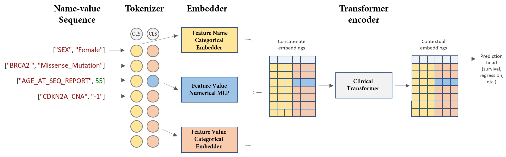

# Clinical Transformer

This repository contains a loose implementation of the **Clinical Transformer** model inspired by the work in the following article:

> **Pretrained transformers applied to clinical studies improve predictions of treatment efficacy and associated biomarkers**  
> Arango-Argoty, Gustavo; Kipkogei, Elly; Stewart, Ross; Patra, Arijit; Kagiampakis, Ioannis; Jacob, Etai.  
> *medRxiv*, 2023. Cold Spring Harbor Laboratory Press.  


If you use this model in your work, please cite the article as:  
@article{arango2023pretrained,  
  title={Pretrained transformers applied to clinical studies improve predictions of treatment efficacy and associated biomarkers},  
  author={Arango-Argoty, Gustavo and Kipkogei, Elly and Stewart, Ross and Patra, Arijit and Kagiampakis, Ioannis and Jacob, Etai},  
  journal={medRxiv},  
  pages={2023--09},  
  year={2023},  
  publisher={Cold Spring Harbor Laboratory Press}  
}  

---

## Clinical Transformer Architecture




## Overview

The **Clinical Transformer** is designed to process clinical data by handling sequences of feature name and feature value pairs. These features can be **categorical** (e.g., `"SEX"`, `"CANCER_TYPE"`) or **numerical** (e.g., `"AGE_AT_SEQ_REPORT"`). This implementation includes a custom tokenizer, collator, and embedder to support the Clinical Transformer. Here are some modifications compared to the original article:

- **Dual-Modality Input:**  
  The model processes each data point (e.g patient sequence) as a sequence of feature pairs. For example:
  [['SEX', 'Female'], ['PRIMARY_RACE', 'White'], ['ETHNICITY', 'Non-Spanish/non-Hispanic'], ['AGE_AT_SEQ_REPORT', 63.0], ['CANCER_TYPE', 'Mature B-Cell Neoplasms']]

  For each pair, the feature name and feature value are tokenized separately.

- **Embedding Layers:**
  - **Categorical Features:**  
    Embedded using `nn.Embedding` (instead of treating them as ordinal arrays).
  - **Numerical Features:**  
    Embedded using an MLP.
  - The resulting embeddings for feature names and feature values are **concatenated** (rather than added) before being fed into the transformer encoder.

- **Masked Language Modeling (MLM):**  
  The model supports MLM where you can choose to mask:
  - Only the feature names,
  - Only the feature values, or
  - Both simultaneously (synchronized masking).

- **Pretrained Initialization for Numerical Features:**  
  Optionally, categorical (text) features can be initialized using a pretrained BERT model.  
  For example, when embedding gene names (e.g., `"BCL2A1"`, `"POU3F2"`, `"RP11-811P12.3"`), there is option to use **SciBERT** from Allen AI.

- **MLFlow Integration:**  
  The project supports MLFlow for logging hyperparameters, metrics, and model artifacts.

- **PyTorch Lightning Module:**  
  The Clinical Transformer is wrapped in a PyTorch Lightning module, which provides effective training, checkpointing, and resuming capabilities.

---

## Data Format and Processing

### Input Data Format

A single data point (e.g. patient) is represented as a list of feature pairs. For example:

```python
[
    ["SEX", "Female"],
    ["AGE_AT_SEQ_REPORT", 55],
    ["CANCER_TYPE", "Breast Cancer"],
    ["GENE", "BCL2A1"],
    # ... additional features
]
```

## Tokenizer Output

After tokenization with the joint tokenizer, each patient’s data is represented as a dictionary with keys for the name modality and the value modality. An example output looks like:

```python
{
  "input_ids_n": tensor([[  1, 2811, 2386,  869,   55, 2811, 2886, 1478]]),
  "attention_mask_n": tensor([[1, 1, 1, 1, 1, 1, 1, 1]]),
  "special_tokens_mask_n": tensor([[1, 0, 0, 0, 0, 0, 0, 0]]),
  "type_mask_n": tensor([[1, 1, 1, 1, 1, 1, 1, 1]]),
  "input_ids_v": tensor([[  1,   46,  144,   93,   16,   83,   83,   83]]),
  "attention_mask_v": tensor([[1, 1, 1, 1, 1, 1, 1, 1]]),
  "special_tokens_mask_v": tensor([[1, 0, 0, 0, 0, 0, 0, 0]]),
  "type_mask_v": tensor([[1, 1, 1, 1, 0, 1, 1, 1]]),
  "labels_n": tensor([[-100, 869, -100, -100, -100, -100, -100, -100]]),
  "labels_v": tensor([[-100,  93, -100, -100, -100, -100, -100, -100]])
}
```
Here’s a breakdown of each field:

### Summary

- **`input_ids_*` fields:** Store the tokenized IDs for names (`_n`) and values (`_v`).
- **`attention_mask_*` fields:** Indicate which tokens are valid versus padded.
- **`special_tokens_mask_*` fields:** Mark the positions of special tokens so that they are not modified during MLM.
- **`type_mask_*` fields:** Distinguish between categorical and numerical tokens.
- **`labels_*` fields:** Provide the target tokens for MLM loss computation, using `-100` to indicate positions that should be ignored.

This design allows the Clinical Transformer to process clinical data where each patient is represented as a sequence of feature pairs. The model processes the two modalities (names and values) separately, yet synchronously, making it flexible for various downstream tasks.


## GENIE Data

This project uses data from the [AACR Project GENIE](https://www.aacr.org/professionals/research/aacr-project-genie/), which provides comprehensive clinical and genomic data from cancer patients. The GENIE dataset includes multiple files that cover different aspects of patient information and tumor genomics:

- **`data_clinical_patient.txt`**  
  Contains patient-level clinical information such as demographics, diagnosis, treatment details, and survival outcomes.

- **`data_clinical_sample.txt`**  
  Contains sample-level details, including information about tumor type, sample collection, and processing details.

- **`data_mutations.txt`**  
  Provides genomic mutation data, detailing the mutation calls (e.g., single nucleotide variants and small indels) observed in patient samples.

- **`data_CNA.txt`**  
  Contains copy number alteration (CNA) data, describing amplifications and deletions in the tumor genomes.

The GENIE data can be downloaded directly via the  (https://genie-public-beta.cbioportal.org/), or from Synapse (https://www.synapse.org/Synapse:syn7222066/wiki/405659).

After downloading the dataset, please run the notebook **`data_ETL_GENIE.ipynb`** included in this repository. This notebook contains code to import and transform the following files into a unified format suitable for model training:

- `data_clinical_patient.txt`
- `data_clinical_sample.txt`
- `data_mutations.txt`
- `data_CNA.txt`

The ETL process cleans, transforms, and aggregates the raw data, ensuring that all necessary clinical and genomic features are correctly formatted for use in the Clinical Transformer.

## How to Run the Project

- Dependences are listed in requirements.txt
- Download the GENIE genetic data 

Run the training script with

```
python train.py
```

## Description of Key Files

- **`config/`**  
  Contains configuration files:
  - **`train_config.py`**: Defines training hyperparameters (e.g., learning rate, batch size, scheduler parameters, etc.).

- **`src/`**  
  Contains the main source code:
  - **`lightning/`**: PyTorch Lightning modules and related utilities.
    - **`clinical_transformer_module.py`**: Wraps the Clinical Transformer model in a LightningModule for training.
    - **`clinical_transformer_data_module.py`**: Handles dataset creation and DataLoader configuration.
  - **`model/`**: Model definitions and associated components.
    - **`clinical_transformer.py`**: Defines the Clinical Transformer model architecture.
    - **`collator.py`**: Custom DataLoader collator that pads sequences, applies masked language modeling (MLM), and optionally shuffles tokens.
    - **`embedder.py`**: Implements embedding layers for both categorical and numerical features.
    - **`tokenizer.py`**: Implements tokenization for feature names and values.
  - **`utils/`**: Utility functions.
    - **`feature_schema.py`**: Loads and validates the GENIE feature schema.
    - **`train_utils.py`**: Contains helper functions for training (e.g., logging hyperparameters, downloading checkpoints).

- **Root Files:**
  - **`.gitignore`**: Specifies files and directories to be ignored by Git.
  - **`data_ETL_GENIE.ipynb`**: A Jupyter Notebook that imports and processes GENIE data files (`data_clinical_patient.txt`, `data_clinical_sample.txt`, `data_mutations.txt`, and `data_CNA.txt`).
  - **`main.py`**: The main entry point for training the model.
  - **`README.md`**: This documentation file.
  - **`requirements.txt`**: Lists the Python dependencies for the project.


## License

This project is licenced under the MIT License.


